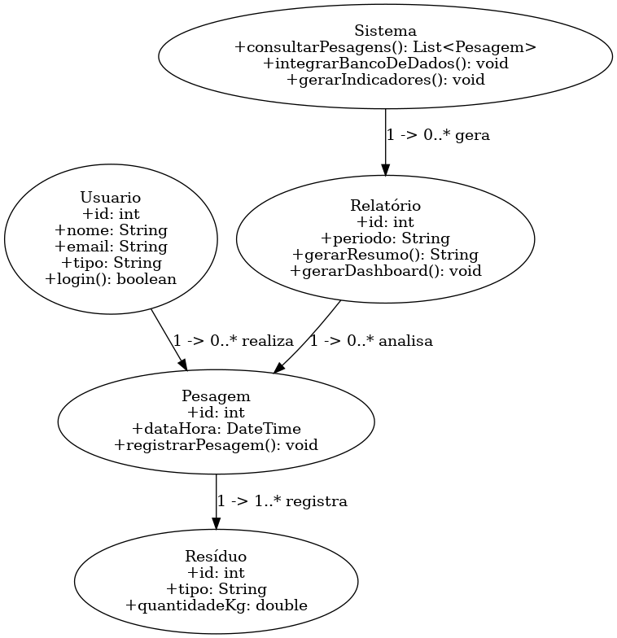

# Arquitetura da Solução

Pré-requisitos: <a href="3-Projeto de Interface.md"> Projeto de Interface</a>

Definição de como o software é estruturado em termos dos componentes que fazem parte da solução e do ambiente de hospedagem da aplicação.

## Diagrama de Classes

- `Usuário` acessa e gera Relatório.
- `Coletor` realiza Coleta.
- `Coleta` agrupa várias Pesagens.
- `Pesagem` está vinculada a um Resíduo.
- `Relatório` utiliza dados de Coletas e Pesagens para gerar indicadores.

## Modelo ER (Projeto Conceitual)

## Projeto da Base de Dados

## ATENÇÃO!!!

Os três artefatos — **Diagrama de Classes, Modelo ER e Projeto da Base de Dados** — devem ser desenvolvidos de forma sequencial e integrada, garantindo total coerência e compatibilidade entre eles. O diagrama de classes orienta a estrutura e o comportamento do software; o modelo ER traduz essa estrutura para o nível conceitual dos dados; e o projeto da base de dados materializa essas definições no formato físico (tabelas, colunas, chaves e restrições). A construção isolada ou desconexa desses elementos pode gerar inconsistências, dificultar a implementação e comprometer a qualidade do sistema.

## Tecnologias Utilizadas

Para implementar a solução proposta, foram utilizadas diversas tecnologias que, em conjunto, possibilitaram o desenvolvimento da aplicação, sua integração com banco de dados e posterior disponibilização ao usuário final. A seguir, estão descritas as principais tecnologias, linguagens, serviços e ferramentas empregadas:

• Linguagem de Programação:
C# com .NET 6/7, utilizada para desenvolvimento de toda a lógica de backend, regras de negócio e integração com o banco de dados.

• Framework Web:
ASP.NET Core MVC, responsável pela criação das páginas, controladores, rotas e interação entre frontend e backend.

• Banco de Dados:
SQL Server, utilizado para armazenamento persistente dos dados referentes a usuários, empresas, coletas, pesagens, resíduos e pontos de coleta.
O acesso é feito via Entity Framework Core, permitindo mapeamento objeto-relacional (ORM) e facilitando manutenção e escalabilidade.

• Desenvolvimento e IDEs:
Visual Studio Code e/ou Visual Studio, para codificação e testes locais da aplicação.

• Gerenciamento de Dependências e Build:
Ferramentas nativas do .NET CLI.

• Repositório e Controle de Versão:
GitHub, onde todo o código-fonte e documentação do projeto ficam armazenados e versionados.

• Hospedagem e Deploy:
Microsoft Azure App Service, responsável pela execução da aplicação em ambiente de nuvem, com alta disponibilidade, monitoramento e deploy automatizado via GitHub Actions.

## Hospedagem

A hospedagem da aplicação foi realizada utilizando a plataforma Microsoft Azure, que oferece um conjunto robusto de serviços em nuvem, alta disponibilidade e facilidade de implantação. A aplicação foi publicada no Azure através do serviço Azure App Service, que permite hospedar aplicações web de forma escalável e com gerenciamento simplificado.

O processo de implantação foi feito diretamente a partir do ambiente de desenvolvimento (VS Code), utilizando integração com repositório GitHub para facilitar atualizações. Sempre que uma nova versão é commitada, o Azure realiza o processo de build e deploy automaticamente, garantindo rapidez e consistência no lançamento de novas funcionalidades.

Além disso, o Azure fornece ferramentas de monitoramento, como Application Insights, que permitem acompanhar logs, desempenho da aplicação e possíveis falhas em tempo real, contribuindo para manutenção contínua da plataforma.

Essa infraestrutura na nuvem garante que o sistema esteja disponível para os usuários de forma estável, segura e escalável, suportando o crescimento da aplicação sem necessidade de grandes ajustes na estrutura.

> **Links Úteis**:
>
> - [Website com GitHub Pages](https://pages.github.com/)
> - [Programação colaborativa com Repl.it](https://repl.it/)
> - [Getting Started with Heroku](https://devcenter.heroku.com/start)
> - [Publicando Seu Site No Heroku](http://pythonclub.com.br/publicando-seu-hello-world-no-heroku.html)
